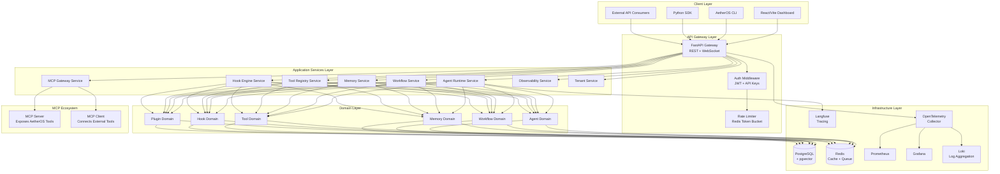
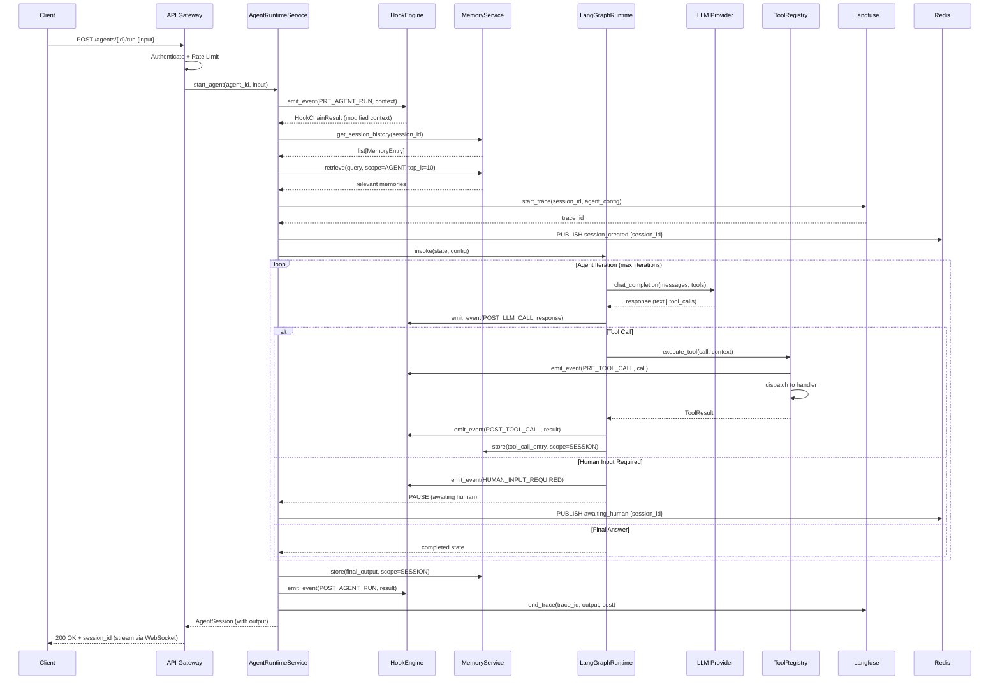
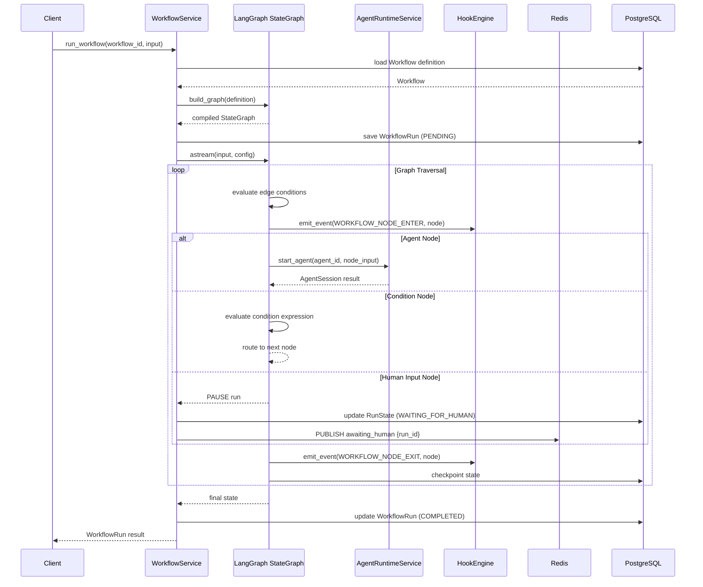
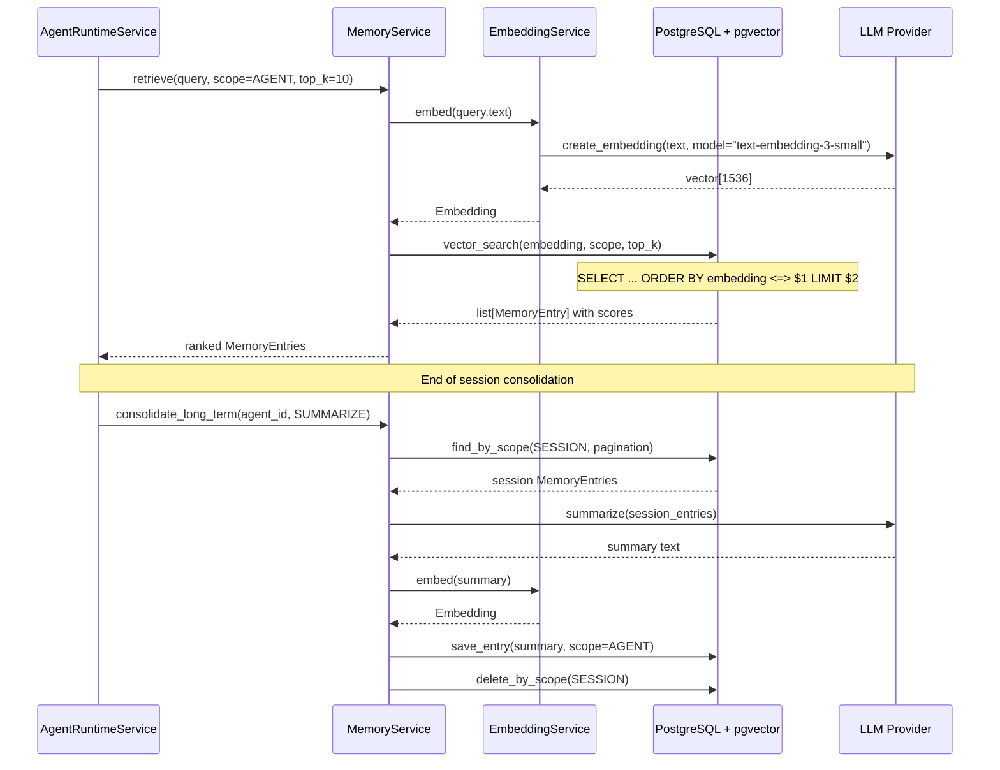
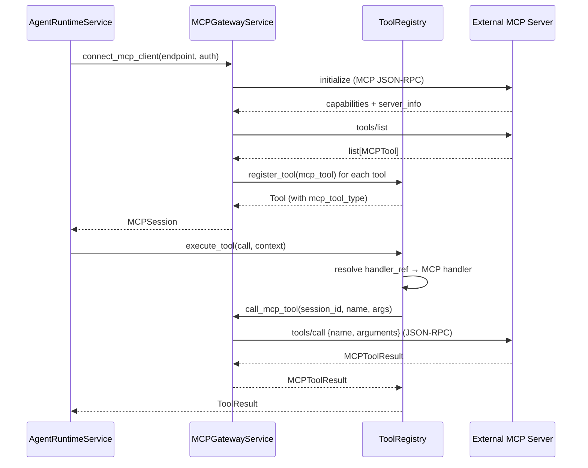
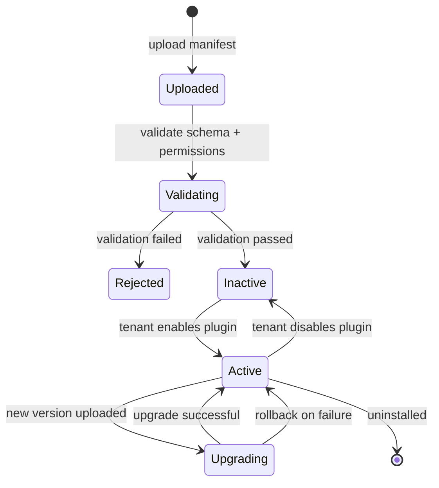
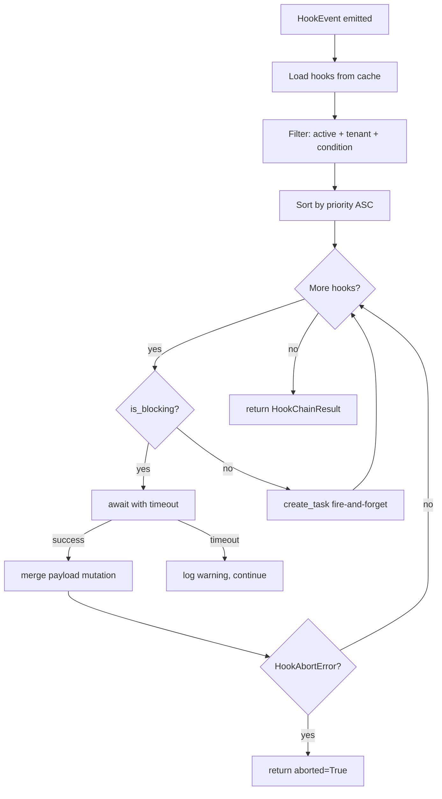
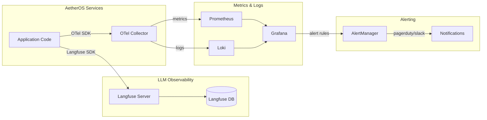

# Design Document: AetherOS — AI Agent Runtime Platform

## Overview

AetherOS is a production-grade, modular AI Operating System designed to orchestrate multiple AI agents
with shared memory, tools, plugins, hooks, tracing, and workflow automation. Inspired by Claude Code,
OpenHands, Cursor, LangGraph, and the Model Context Protocol (MCP), AetherOS provides an enterprise-ready
platform for deploying, monitoring, and evolving autonomous AI workflows at scale.

The platform is built around a Clean Architecture with Domain-Driven Design principles, separating domain
logic from infrastructure concerns. It supports multi-tenancy, real-time observability via OpenTelemetry
and Langfuse, semantic/long-term memory via pgvector, and flexible agent composition through LangGraph
conditional edges. The design serves as the permanent architectural reference across all seven
development phases and deliberately avoids any implementation code — it defines contracts, boundaries,
and algorithms only.

AetherOS is organized into eight bounded contexts: **Agent Runtime**, **Memory**, **Tool & Plugin
Registry**, **Hook Engine**, **Workflow Orchestration**, **Observability**, **Tenant & Identity**, and
**MCP Gateway**. Each context owns its domain model, repository interfaces, service layer, and API
surface. The platform exposes a FastAPI backend with WebSocket support for streaming, a React/Vite
frontend for agent management, and a suite of CLI and SDK clients.

---

## Table of Contents

1. High-Level Architecture
2. Bounded Contexts & Domain Model
3. Component Interfaces
4. Data Models
5. Sequence Diagrams — Core Flows
6. Low-Level Design — Algorithms & Function Signatures
7. Memory Subsystem
8. Tool & Plugin Registry
9. Hook Engine
10. Workflow Orchestration (LangGraph)
11. MCP Gateway
12. Observability & Tracing
13. Multi-Tenancy & Identity
14. Frontend Architecture
15. Infrastructure & Deployment
16. Error Handling Strategy
17. Testing Strategy
18. Security Considerations
19. Performance Considerations
20. Seven-Phase Roadmap
21. Dependencies

---

## 1. High-Level Architecture





### 1.1 Architectural Layers

| Layer | Responsibility | Key Technologies |
|---|---|---|
| Client | User interfaces and programmatic access | React, Vite, TailwindCSS, Python SDK |
| API Gateway | Request routing, auth, rate limiting, WebSocket streaming | FastAPI, Redis |
| Application Services | Use-case orchestration, cross-cutting concerns | Python 3.13 async |
| Domain | Business rules, entities, value objects, domain events | Pure Python, DDD |
| Infrastructure | Persistence, caching, messaging, external integrations | PostgreSQL, Redis, Langfuse |
| Observability | Traces, metrics, logs, cost tracking | OpenTelemetry, Prometheus, Grafana, Loki |

### 1.2 Cross-Cutting Concerns

- **Dependency Injection**: All services receive dependencies via constructor injection. A `Container` class (using `dependency-injector`) wires the object graph at startup.
- **Async First**: All I/O operations use `async/await`. CPU-bound tasks are offloaded to `asyncio.run_in_executor`.
- **Event Bus**: Domain events published via an in-process async event bus (Redis pub/sub for cross-service events in distributed deployments).
- **Correlation IDs**: Every request carries a `correlation_id` propagated through all layers and recorded in traces and logs.
- **Feature Flags**: Runtime feature toggles stored in Redis, evaluated by the `FeatureFlagService`.

---

## 2. Bounded Contexts & Domain Model


```mermaid
graph LR
    subgraph "Agent Runtime BC"
        A1[Agent]
        A2[AgentSession]
        A3[AgentConfig]
        A4[AgentStatus]
    end
    subgraph "Memory BC"
        M1[MemoryStore]
        M2[MemoryEntry]
        M3[EmbeddingRecord]
        M4[MemoryScope]
    end
    subgraph "Tool & Plugin BC"
        T1[Tool]
        T2[ToolCall]
        T3[ToolResult]
        T4[Plugin]
        T5[PluginManifest]
    end
    subgraph "Hook BC"
        H1[Hook]
        H2[HookEvent]
        H3[HookHandler]
        H4[HookChain]
    end
    subgraph "Workflow BC"
        W1[Workflow]
        W2[WorkflowNode]
        W3[WorkflowEdge]
        W4[WorkflowRun]
        W5[RunState]
    end
    subgraph "Observability BC"
        O1[Trace]
        O2[Span]
        O3[CostRecord]
        O4[EvalResult]
    end
    subgraph "Tenant BC"
        N1[Tenant]
        N2[User]
        N3[ApiKey]
        N4[Permission]
    end
    subgraph "MCP Gateway BC"
        P1[MCPServer]
        P2[MCPClient]
        P3[MCPTool]
        P4[MCPSession]
    end

    A1 --> M1 : uses
    A1 --> T1 : calls
    A1 --> H1 : triggers
    W1 --> A1 : orchestrates
    A2 --> O1 : emits
    T4 --> T1 : provides
    P2 --> T1 : exposes as
    N1 --> A1 : owns
```


---

## 3. Component Interfaces

### 3.1 Agent Runtime Service

```python
class AgentRuntimeService(Protocol):
    async def create_agent(
        self, config: AgentConfig, tenant_id: TenantId
    ) -> Agent: ...

    async def start_agent(
        self, agent_id: AgentId, initial_input: AgentInput
    ) -> AgentSession: ...

    async def stop_agent(self, agent_id: AgentId) -> None: ...

    async def get_agent_status(self, agent_id: AgentId) -> AgentStatus: ...

    async def stream_agent_output(
        self, session_id: SessionId
    ) -> AsyncIterator[AgentOutputChunk]: ...

    async def inject_human_feedback(
        self, session_id: SessionId, feedback: HumanFeedback
    ) -> None: ...

    async def list_agents(
        self, tenant_id: TenantId, filters: AgentFilter
    ) -> Page[Agent]: ...
```

### 3.2 Workflow Service

```python
class WorkflowService(Protocol):
    async def create_workflow(
        self, definition: WorkflowDefinition, tenant_id: TenantId
    ) -> Workflow: ...

    async def run_workflow(
        self, workflow_id: WorkflowId, input_data: dict[str, Any]
    ) -> WorkflowRun: ...

    async def get_run_state(self, run_id: RunId) -> RunState: ...

    async def pause_run(self, run_id: RunId) -> None: ...

    async def resume_run(
        self, run_id: RunId, resume_data: dict[str, Any]
    ) -> None: ...

    async def cancel_run(self, run_id: RunId) -> None: ...

    async def list_runs(
        self, workflow_id: WorkflowId, filters: RunFilter
    ) -> Page[WorkflowRun]: ...
```

### 3.3 Memory Service

```python
class MemoryService(Protocol):
    async def store(
        self, entry: MemoryEntry, scope: MemoryScope
    ) -> MemoryEntryId: ...

    async def retrieve(
        self, query: MemoryQuery, scope: MemoryScope, top_k: int = 10
    ) -> list[MemoryEntry]: ...

    async def delete(self, entry_id: MemoryEntryId) -> None: ...

    async def clear_scope(self, scope: MemoryScope) -> None: ...

    async def get_session_history(
        self, session_id: SessionId
    ) -> list[MemoryEntry]: ...

    async def consolidate_long_term(
        self, agent_id: AgentId, strategy: ConsolidationStrategy
    ) -> None: ...
```

### 3.4 Tool Registry Service

```python
class ToolRegistryService(Protocol):
    async def register_tool(self, tool: ToolDefinition) -> Tool: ...

    async def unregister_tool(self, tool_id: ToolId) -> None: ...

    async def get_tool(self, tool_id: ToolId) -> Tool: ...

    async def list_tools(
        self, filters: ToolFilter
    ) -> list[Tool]: ...

    async def execute_tool(
        self, call: ToolCall, context: ExecutionContext
    ) -> ToolResult: ...

    async def install_plugin(
        self, manifest: PluginManifest, tenant_id: TenantId
    ) -> Plugin: ...

    async def uninstall_plugin(self, plugin_id: PluginId) -> None: ...
```

### 3.5 Hook Engine Service

```python
class HookEngineService(Protocol):
    async def register_hook(self, hook: HookDefinition) -> Hook: ...

    async def unregister_hook(self, hook_id: HookId) -> None: ...

    async def emit_event(
        self, event: HookEvent, context: HookContext
    ) -> HookChainResult: ...

    async def list_hooks(
        self, event_type: HookEventType
    ) -> list[Hook]: ...

    async def get_hook_execution_log(
        self, hook_id: HookId, since: datetime
    ) -> list[HookExecution]: ...
```

### 3.6 MCP Gateway Service

```python
class MCPGatewayService(Protocol):
    async def start_mcp_server(self, config: MCPServerConfig) -> MCPServer: ...

    async def stop_mcp_server(self, server_id: MCPServerId) -> None: ...

    async def connect_mcp_client(
        self, endpoint: str, auth: MCPAuth
    ) -> MCPSession: ...

    async def disconnect_mcp_client(self, session_id: MCPSessionId) -> None: ...

    async def call_mcp_tool(
        self, session_id: MCPSessionId, tool_name: str, arguments: dict[str, Any]
    ) -> MCPToolResult: ...

    async def list_mcp_tools(
        self, session_id: MCPSessionId
    ) -> list[MCPTool]: ...
```

### 3.7 Repository Interfaces

```python
class AgentRepository(Protocol):
    async def save(self, agent: Agent) -> None: ...
    async def find_by_id(self, agent_id: AgentId) -> Agent | None: ...
    async def find_by_tenant(
        self, tenant_id: TenantId, pagination: Pagination
    ) -> Page[Agent]: ...
    async def delete(self, agent_id: AgentId) -> None: ...
    async def exists(self, agent_id: AgentId) -> bool: ...

class WorkflowRepository(Protocol):
    async def save(self, workflow: Workflow) -> None: ...
    async def find_by_id(self, workflow_id: WorkflowId) -> Workflow | None: ...
    async def find_runs_by_workflow(
        self, workflow_id: WorkflowId, pagination: Pagination
    ) -> Page[WorkflowRun]: ...
    async def save_run(self, run: WorkflowRun) -> None: ...
    async def find_run_by_id(self, run_id: RunId) -> WorkflowRun | None: ...

class MemoryRepository(Protocol):
    async def save_entry(self, entry: MemoryEntry) -> None: ...
    async def vector_search(
        self, embedding: Embedding, scope: MemoryScope, top_k: int
    ) -> list[MemoryEntry]: ...
    async def find_by_scope(
        self, scope: MemoryScope, pagination: Pagination
    ) -> Page[MemoryEntry]: ...
    async def delete_entry(self, entry_id: MemoryEntryId) -> None: ...
    async def delete_by_scope(self, scope: MemoryScope) -> None: ...
```

---

## 4. Data Models


### 4.1 Core Domain Entities

```python
# ---------- Value Objects ----------

@dataclass(frozen=True)
class AgentId:
    value: UUID

@dataclass(frozen=True)
class TenantId:
    value: UUID

@dataclass(frozen=True)
class SessionId:
    value: UUID

@dataclass(frozen=True)
class WorkflowId:
    value: UUID

@dataclass(frozen=True)
class RunId:
    value: UUID

@dataclass(frozen=True)
class MemoryEntryId:
    value: UUID

@dataclass(frozen=True)
class ToolId:
    value: str  # namespaced: "namespace/tool-name@version"

@dataclass(frozen=True)
class PluginId:
    value: UUID

@dataclass(frozen=True)
class HookId:
    value: UUID

@dataclass(frozen=True)
class Embedding:
    vector: list[float]
    model: str
    dimensions: int

# ---------- Agent Domain ----------

class AgentStatus(str, Enum):
    IDLE = "idle"
    RUNNING = "running"
    PAUSED = "paused"
    WAITING_FOR_HUMAN = "waiting_for_human"
    COMPLETED = "completed"
    FAILED = "failed"
    CANCELLED = "cancelled"

@dataclass
class AgentConfig:
    name: str
    description: str
    model: str                          # e.g. "gpt-4o", "claude-3-5-sonnet"
    system_prompt_id: str | None        # references prompt version in Langfuse
    system_prompt_text: str | None      # inline fallback
    tools: list[ToolId]
    plugins: list[PluginId]
    memory_scopes: list[MemoryScope]
    max_iterations: int
    timeout_seconds: int
    temperature: float
    metadata: dict[str, Any]

@dataclass
class Agent:
    id: AgentId
    tenant_id: TenantId
    config: AgentConfig
    status: AgentStatus
    created_at: datetime
    updated_at: datetime
    tags: list[str]

@dataclass
class AgentSession:
    id: SessionId
    agent_id: AgentId
    tenant_id: TenantId
    status: AgentStatus
    started_at: datetime
    ended_at: datetime | None
    iteration_count: int
    input: dict[str, Any]
    output: dict[str, Any] | None
    error: str | None
    trace_id: str | None                # Langfuse trace ID
    run_id: RunId | None                # associated workflow run

@dataclass
class AgentInput:
    content: str
    attachments: list[Attachment]
    context_override: dict[str, Any]
    metadata: dict[str, Any]

@dataclass
class AgentOutputChunk:
    session_id: SessionId
    sequence: int
    content: str
    chunk_type: Literal["text", "tool_call", "tool_result", "status", "error"]
    metadata: dict[str, Any]

@dataclass
class HumanFeedback:
    session_id: SessionId
    content: str
    approved: bool | None
    metadata: dict[str, Any]
```

### 4.2 Memory Domain

```python
class MemoryScopeType(str, Enum):
    SESSION = "session"         # ephemeral: lives for one session
    AGENT = "agent"             # agent-scoped: persists across sessions
    TENANT = "tenant"           # tenant-scoped: shared across all agents
    GLOBAL = "global"           # platform-wide read-only knowledge

class MemoryEntryType(str, Enum):
    MESSAGE = "message"
    TOOL_CALL = "tool_call"
    OBSERVATION = "observation"
    SUMMARY = "summary"
    FACT = "fact"
    DOCUMENT = "document"

@dataclass(frozen=True)
class MemoryScope:
    scope_type: MemoryScopeType
    scope_id: str               # session_id, agent_id, tenant_id, or "global"

@dataclass
class MemoryEntry:
    id: MemoryEntryId
    scope: MemoryScope
    entry_type: MemoryEntryType
    content: str
    embedding: Embedding | None
    metadata: dict[str, Any]
    created_at: datetime
    relevance_score: float | None   # populated during retrieval

@dataclass
class MemoryQuery:
    text: str
    embedding: Embedding | None     # pre-computed embedding if available
    filters: dict[str, Any]
    entry_types: list[MemoryEntryType]

class ConsolidationStrategy(str, Enum):
    SUMMARIZE = "summarize"         # LLM-summarize session memories
    EXTRACT_FACTS = "extract_facts" # extract key facts from session
    DEDUPLICATE = "deduplicate"     # remove duplicate entries
```

### 4.3 Tool & Plugin Domain

```python
class ToolType(str, Enum):
    BUILTIN = "builtin"
    MCP = "mcp"
    PLUGIN = "plugin"
    CUSTOM = "custom"

@dataclass
class ToolParameter:
    name: str
    type: str               # JSON Schema type
    description: str
    required: bool
    default: Any | None
    enum_values: list[Any] | None

@dataclass
class ToolDefinition:
    id: ToolId
    name: str
    description: str
    tool_type: ToolType
    parameters: list[ToolParameter]
    returns: dict[str, Any]     # JSON Schema of return type
    handler_ref: str            # dotted Python path or MCP endpoint
    version: str
    tags: list[str]
    metadata: dict[str, Any]

@dataclass
class Tool:
    definition: ToolDefinition
    is_enabled: bool
    tenant_id: TenantId | None  # None = platform-wide
    created_at: datetime

@dataclass
class ToolCall:
    id: str                     # unique call ID for tracing
    tool_id: ToolId
    arguments: dict[str, Any]
    caller_session_id: SessionId
    initiated_at: datetime

@dataclass
class ToolResult:
    call_id: str
    tool_id: ToolId
    success: bool
    output: Any
    error: str | None
    execution_time_ms: int
    cost_tokens: int | None

@dataclass
class PluginManifest:
    id: PluginId
    name: str
    version: str
    description: str
    author: str
    tools: list[ToolDefinition]
    hooks: list[HookDefinition]
    permissions: list[str]
    config_schema: dict[str, Any]   # JSON Schema for plugin config
    entry_point: str                # Python module path

@dataclass
class Plugin:
    manifest: PluginManifest
    tenant_id: TenantId
    config: dict[str, Any]
    is_active: bool
    installed_at: datetime
```

### 4.4 Hook Domain

```python
class HookEventType(str, Enum):
    PRE_AGENT_RUN = "pre_agent_run"
    POST_AGENT_RUN = "post_agent_run"
    PRE_TOOL_CALL = "pre_tool_call"
    POST_TOOL_CALL = "post_tool_call"
    PRE_LLM_CALL = "pre_llm_call"
    POST_LLM_CALL = "post_llm_call"
    AGENT_ERROR = "agent_error"
    HUMAN_INPUT_REQUIRED = "human_input_required"
    WORKFLOW_NODE_ENTER = "workflow_node_enter"
    WORKFLOW_NODE_EXIT = "workflow_node_exit"
    MEMORY_WRITE = "memory_write"
    MEMORY_READ = "memory_read"

class HookPriority(int, Enum):
    CRITICAL = 0
    HIGH = 10
    NORMAL = 50
    LOW = 100

@dataclass
class HookDefinition:
    id: HookId
    name: str
    event_type: HookEventType
    handler_ref: str            # dotted Python callable path
    priority: HookPriority
    is_blocking: bool           # True = can modify event payload
    timeout_ms: int
    retry_count: int
    conditions: dict[str, Any]  # JSONLogic expression for conditional execution

@dataclass
class Hook:
    definition: HookDefinition
    tenant_id: TenantId | None
    is_active: bool
    created_at: datetime

@dataclass
class HookEvent:
    event_id: str
    event_type: HookEventType
    source: str
    payload: dict[str, Any]
    correlation_id: str
    tenant_id: TenantId
    emitted_at: datetime

@dataclass
class HookContext:
    event: HookEvent
    session: AgentSession | None
    metadata: dict[str, Any]

@dataclass
class HookChainResult:
    event_id: str
    handlers_executed: int
    payload: dict[str, Any]     # final (possibly modified) payload
    aborted: bool               # True if a handler aborted the chain
    abort_reason: str | None
    execution_time_ms: int
```

### 4.5 Workflow Domain

```python
class WorkflowNodeType(str, Enum):
    AGENT = "agent"
    TOOL = "tool"
    CONDITION = "condition"
    HUMAN_INPUT = "human_input"
    PARALLEL = "parallel"
    WAIT = "wait"
    START = "start"
    END = "end"

class RunStatus(str, Enum):
    PENDING = "pending"
    RUNNING = "running"
    PAUSED = "paused"
    WAITING_FOR_HUMAN = "waiting_for_human"
    COMPLETED = "completed"
    FAILED = "failed"
    CANCELLED = "cancelled"

@dataclass
class WorkflowNode:
    id: str
    node_type: WorkflowNodeType
    name: str
    config: dict[str, Any]      # node-type specific config
    agent_id: AgentId | None    # for AGENT nodes
    tool_id: ToolId | None      # for TOOL nodes

@dataclass
class WorkflowEdge:
    source_node_id: str
    target_node_id: str
    condition: str | None       # Python expression evaluated against RunState
    label: str | None

@dataclass
class WorkflowDefinition:
    name: str
    description: str
    nodes: list[WorkflowNode]
    edges: list[WorkflowEdge]
    input_schema: dict[str, Any]
    output_schema: dict[str, Any]
    metadata: dict[str, Any]

@dataclass
class Workflow:
    id: WorkflowId
    tenant_id: TenantId
    definition: WorkflowDefinition
    version: int
    is_active: bool
    created_at: datetime
    updated_at: datetime

@dataclass
class RunState:
    run_id: RunId
    workflow_id: WorkflowId
    status: RunStatus
    current_node_id: str | None
    state_data: dict[str, Any]  # LangGraph state dict
    started_at: datetime
    updated_at: datetime
    completed_at: datetime | None
    error: str | None

@dataclass
class WorkflowRun:
    id: RunId
    workflow_id: WorkflowId
    tenant_id: TenantId
    state: RunState
    input_data: dict[str, Any]
    output_data: dict[str, Any] | None
    trace_id: str | None
```

### 4.6 Observability Domain

```python
@dataclass
class CostRecord:
    id: UUID
    tenant_id: TenantId
    session_id: SessionId | None
    run_id: RunId | None
    model: str
    prompt_tokens: int
    completion_tokens: int
    total_tokens: int
    cost_usd: Decimal
    recorded_at: datetime

@dataclass
class EvalResult:
    id: UUID
    session_id: SessionId
    evaluator: str
    score: float                # 0.0 to 1.0
    criteria: str
    reasoning: str | None
    evaluated_at: datetime

@dataclass
class PromptVersion:
    id: str
    name: str
    version: str
    content: str
    variables: list[str]
    model_defaults: dict[str, Any]
    created_at: datetime
    is_active: bool
```

### 4.7 Tenant & Identity Domain

```python
class TenantTier(str, Enum):
    FREE = "free"
    PRO = "pro"
    ENTERPRISE = "enterprise"

@dataclass
class Tenant:
    id: TenantId
    name: str
    tier: TenantTier
    settings: dict[str, Any]
    is_active: bool
    created_at: datetime

@dataclass
class User:
    id: UUID
    tenant_id: TenantId
    email: str
    role: str                   # admin, member, viewer
    is_active: bool
    created_at: datetime

@dataclass
class ApiKey:
    id: UUID
    tenant_id: TenantId
    user_id: UUID | None
    key_hash: str               # bcrypt hash, never store raw
    scopes: list[str]
    expires_at: datetime | None
    last_used_at: datetime | None
    created_at: datetime
```

---

## 5. Sequence Diagrams — Core Flows

### 5.1 Agent Execution Flow




### 5.2 Workflow Orchestration Flow



### 5.3 Memory Retrieval & Consolidation Flow



### 5.4 MCP Tool Discovery & Execution Flow



---

## 6. Low-Level Design — Algorithms & Function Signatures

### 6.1 Agent Runtime — Core Execution Loop


```python
class AgentRuntimeServiceImpl:
    """
    Core agent execution orchestrator.

    Preconditions:
      - agent_id references an existing Agent with status IDLE or COMPLETED
      - tenant_id matches agent.tenant_id
      - AgentConfig.tools all exist in ToolRegistry
      - max_iterations >= 1

    Postconditions:
      - Returns AgentSession with status COMPLETED, FAILED, or WAITING_FOR_HUMAN
      - All LLM interactions recorded in Langfuse trace
      - Session memories persisted to MemoryRepository
      - POST_AGENT_RUN hook chain executed

    Loop Invariant (iteration loop):
      - iteration_count <= max_iterations
      - AgentSession.status == RUNNING throughout loop
      - All previous tool calls recorded in session memory
    """

    async def start_agent(
        self,
        agent_id: AgentId,
        initial_input: AgentInput,
        correlation_id: str,
    ) -> AgentSession:
        # 1. Load and validate agent
        agent = await self._agent_repo.find_by_id(agent_id)
        self._validate_agent_runnable(agent)

        # 2. Create session
        session = AgentSession(
            id=SessionId(uuid4()),
            agent_id=agent_id,
            tenant_id=agent.tenant_id,
            status=AgentStatus.RUNNING,
            started_at=datetime.utcnow(),
            ended_at=None,
            iteration_count=0,
            input=asdict(initial_input),
            output=None,
            error=None,
            trace_id=None,
            run_id=None,
        )

        # 3. Pre-run hook
        hook_result = await self._hook_engine.emit_event(
            HookEvent(
                event_id=str(uuid4()),
                event_type=HookEventType.PRE_AGENT_RUN,
                source=f"agent:{agent_id.value}",
                payload={"session": asdict(session), "input": asdict(initial_input)},
                correlation_id=correlation_id,
                tenant_id=agent.tenant_id,
                emitted_at=datetime.utcnow(),
            ),
            HookContext(event=..., session=session, metadata={}),
        )
        if hook_result.aborted:
            raise AgentRunAbortedError(hook_result.abort_reason)

        # 4. Start Langfuse trace
        trace_id = await self._langfuse.start_trace(
            name=f"agent_run:{agent.config.name}",
            metadata={"agent_id": str(agent_id.value), "session_id": str(session.id.value)},
        )
        session.trace_id = trace_id

        # 5. Build LangGraph state
        messages = await self._build_initial_messages(agent, initial_input, session)
        graph_state = {"messages": messages, "session": session, "agent": agent}

        # 6. Run graph (streaming)
        try:
            async for chunk in self._langgraph_runtime.astream(graph_state, agent.config):
                await self._publish_output_chunk(session.id, chunk)
                if chunk.chunk_type == "status" and chunk.content == "human_required":
                    session.status = AgentStatus.WAITING_FOR_HUMAN
                    break
            else:
                session.status = AgentStatus.COMPLETED
                session.output = await self._extract_final_output(graph_state)

        except AgentTimeoutError as e:
            session.status = AgentStatus.FAILED
            session.error = f"Timeout after {agent.config.timeout_seconds}s"
            await self._hook_engine.emit_event(
                HookEvent(event_type=HookEventType.AGENT_ERROR, payload={"error": str(e)}, ...),
                HookContext(...),
            )
        except Exception as e:
            session.status = AgentStatus.FAILED
            session.error = str(e)
            raise

        finally:
            session.ended_at = datetime.utcnow()
            await self._session_repo.save(session)
            await self._langfuse.end_trace(trace_id, session.output, session.error)
            await self._hook_engine.emit_event(
                HookEvent(event_type=HookEventType.POST_AGENT_RUN, ...),
                HookContext(session=session, ...),
            )

        return session

    async def _build_initial_messages(
        self,
        agent: Agent,
        initial_input: AgentInput,
        session: AgentSession,
    ) -> list[BaseMessage]:
        """
        Constructs the LangChain message list for the initial LLM call.

        Preconditions:
          - agent.config.system_prompt_id or system_prompt_text is set
          - Memory service is available

        Postconditions:
          - Returns ordered list: [SystemMessage, ...HistoryMessages, HumanMessage]
          - Length <= context_window_token_limit (managed by token trimmer)
        """
        system_prompt = await self._resolve_system_prompt(agent.config)
        history = await self._memory_service.get_session_history(session.id)
        semantic_memories = await self._memory_service.retrieve(
            MemoryQuery(text=initial_input.content, embedding=None, filters={}, entry_types=[]),
            scope=MemoryScope(MemoryScopeType.AGENT, str(agent.id.value)),
            top_k=10,
        )
        messages = [SystemMessage(content=system_prompt)]
        if semantic_memories:
            memories_block = self._format_memories(semantic_memories)
            messages.append(SystemMessage(content=f"Relevant context:\n{memories_block}"))
        messages.extend(self._convert_history_to_messages(history))
        messages.append(HumanMessage(content=initial_input.content))
        return self._token_trimmer.trim(messages, max_tokens=agent.config.context_window_tokens)
```

### 6.2 LangGraph Runtime — Graph Builder

```python
class LangGraphRuntime:
    """
    Builds and compiles LangGraph StateGraphs from WorkflowDefinitions.

    Key design decisions:
    - One compiled graph per Workflow version, cached in Redis
    - Checkpointing via PostgresSaver (LangGraph persistence)
    - Conditional edges evaluated as safe Python expressions against RunState
    - Human-in-the-loop via interrupt() + resume()
    """

    async def build_graph(
        self,
        definition: WorkflowDefinition,
    ) -> CompiledStateGraph:
        """
        Preconditions:
          - definition.nodes is non-empty
          - Exactly one START node and one END node exist
          - All edge source/target node IDs reference defined nodes
          - No circular dependencies without at least one conditional break

        Postconditions:
          - Returns compiled graph ready for invocation
          - Graph is cached by (workflow_id, version) key

        Algorithm:
          1. Create StateGraph with AgentState TypedDict
          2. For each node in definition.nodes:
             a. Create node function from node config
             b. Add to graph: graph.add_node(node.id, node_fn)
          3. For each edge in definition.edges:
             a. If edge.condition is None: graph.add_edge(source, target)
             b. Else: build conditional router, graph.add_conditional_edges(source, router, mapping)
          4. Set entry point to START node
          5. Compile with checkpointer=PostgresSaver(pool)
        """
        graph = StateGraph(AgentState)
        node_map: dict[str, Callable] = {}

        for node in definition.nodes:
            node_fn = await self._create_node_function(node)
            graph.add_node(node.id, node_fn)
            node_map[node.id] = node_fn

        conditional_groups: dict[str, list[WorkflowEdge]] = defaultdict(list)
        for edge in definition.edges:
            if edge.condition:
                conditional_groups[edge.source_node_id].append(edge)
            else:
                graph.add_edge(edge.source_node_id, edge.target_node_id)

        for source_id, cond_edges in conditional_groups.items():
            router = self._build_conditional_router(cond_edges)
            target_map = {e.label or e.target_node_id: e.target_node_id for e in cond_edges}
            graph.add_conditional_edges(source_id, router, target_map)

        graph.set_entry_point(self._find_start_node(definition).id)
        checkpointer = PostgresSaver(self._db_pool)
        return graph.compile(checkpointer=checkpointer, interrupt_before=self._find_human_nodes(definition))

    def _build_conditional_router(
        self,
        edges: list[WorkflowEdge],
    ) -> Callable[[AgentState], str]:
        """
        Compiles conditional edges into a router function.

        Preconditions:
          - All edge.condition strings are valid Python expressions
          - Expressions reference only keys present in AgentState
          - At most one edge per condition group may have condition=None (default)

        Postconditions:
          - Returns a callable that maps state → edge label
          - If no condition matches and default edge exists, returns default label
          - If no condition matches and no default, raises RoutingError

        Security Note: Expressions are evaluated in a sandboxed namespace
        containing only state data and safe builtins. No exec/eval of user
        input in production — conditions are authored by tenant admins only.
        """
        compiled_conditions: list[tuple[str, CodeType, str]] = []
        default_label: str | None = None

        for edge in edges:
            if edge.condition is None:
                default_label = edge.label or edge.target_node_id
            else:
                code = compile(edge.condition, "<condition>", "eval")
                compiled_conditions.append((edge.label or edge.target_node_id, code, edge.condition))

        def router(state: AgentState) -> str:
            safe_ns = {k: v for k, v in state.items() if isinstance(k, str)}
            for label, code, _ in compiled_conditions:
                if eval(code, {"__builtins__": {}}, safe_ns):  # noqa: S307
                    return label
            if default_label:
                return default_label
            raise RoutingError(f"No matching edge condition for state keys: {list(state.keys())}")

        return router
```

### 6.3 Memory Service — Vector Search & Consolidation

```python
class MemoryServiceImpl:
    """
    Hybrid memory system combining vector similarity search with structured
    key-value retrieval across multiple scopes.
    """

    async def retrieve(
        self,
        query: MemoryQuery,
        scope: MemoryScope,
        top_k: int = 10,
    ) -> list[MemoryEntry]:
        """
        Hybrid retrieval: vector similarity + metadata filtering.

        Preconditions:
          - query.text is non-empty OR query.embedding is provided
          - top_k >= 1 and top_k <= MAX_RETRIEVAL_K (= 100)
          - scope.scope_type is a valid MemoryScopeType

        Postconditions:
          - Returns list of at most top_k MemoryEntries
          - Entries ordered by relevance_score descending
          - Each entry.relevance_score is in [0.0, 1.0]
          - Entries belong to the given scope

        Algorithm:
          1. Compute embedding if not pre-provided
          2. Build pgvector query with scope filter
          3. Retrieve top_k * OVERSAMPLING_FACTOR candidates
          4. Apply metadata filters (entry_types, date range, etc.)
          5. Re-rank by combining cosine similarity + recency decay
          6. Return top_k after re-ranking
        """
        OVERSAMPLING_FACTOR = 3
        embedding = query.embedding or await self._embedding_service.embed(query.text)

        candidates = await self._memory_repo.vector_search(
            embedding=embedding,
            scope=scope,
            top_k=top_k * OVERSAMPLING_FACTOR,
        )

        if query.entry_types:
            candidates = [e for e in candidates if e.entry_type in query.entry_types]

        if query.filters:
            candidates = self._apply_metadata_filters(candidates, query.filters)

        re_ranked = self._re_rank_with_recency_decay(candidates)
        return re_ranked[:top_k]

    def _re_rank_with_recency_decay(
        self,
        entries: list[MemoryEntry],
    ) -> list[MemoryEntry]:
        """
        Re-ranks entries combining vector similarity score and recency.

        Formula:
          combined_score = (1 - RECENCY_WEIGHT) * similarity + RECENCY_WEIGHT * recency_factor
          recency_factor = exp(-decay_rate * age_in_hours)

        Constants:
          RECENCY_WEIGHT = 0.15
          DECAY_RATE = 0.01  (half-life ≈ 69 hours)

        Preconditions:
          - All entries have relevance_score set (from vector search)
          - All entries have created_at set

        Postconditions:
          - Returns entries sorted by combined_score descending
          - All scores remain in [0.0, 1.0]
        """
        RECENCY_WEIGHT = 0.15
        DECAY_RATE = 0.01
        now = datetime.utcnow()

        for entry in entries:
            age_hours = (now - entry.created_at).total_seconds() / 3600
            recency = math.exp(-DECAY_RATE * age_hours)
            sim = entry.relevance_score or 0.0
            entry.relevance_score = (1 - RECENCY_WEIGHT) * sim + RECENCY_WEIGHT * recency

        return sorted(entries, key=lambda e: e.relevance_score or 0.0, reverse=True)

    async def consolidate_long_term(
        self,
        agent_id: AgentId,
        strategy: ConsolidationStrategy,
    ) -> None:
        """
        Moves session-scoped memories to agent-scoped long-term memory.

        Preconditions:
          - strategy is a valid ConsolidationStrategy
          - agent_id exists in AgentRepository

        Postconditions:
          - Session-scoped entries are deleted
          - Consolidated entries written to agent scope
          - At least one consolidated entry created if source entries > 0

        Strategies:
          SUMMARIZE: LLM produces a narrative summary
          EXTRACT_FACTS: LLM extracts bullet-point facts
          DEDUPLICATE: Embed all entries, cluster, keep centroid of each cluster
        """
        session_scope = MemoryScope(MemoryScopeType.SESSION, str(agent_id.value))
        all_entries = await self._collect_all_entries(session_scope)

        if not all_entries:
            return

        match strategy:
            case ConsolidationStrategy.SUMMARIZE:
                text = self._format_entries_for_llm(all_entries)
                summary = await self._llm.summarize(text, max_tokens=500)
                await self._write_consolidated_entry(agent_id, summary, MemoryEntryType.SUMMARY)
            case ConsolidationStrategy.EXTRACT_FACTS:
                text = self._format_entries_for_llm(all_entries)
                facts = await self._llm.extract_facts(text)
                for fact in facts:
                    await self._write_consolidated_entry(agent_id, fact, MemoryEntryType.FACT)
            case ConsolidationStrategy.DEDUPLICATE:
                await self._deduplicate_and_cluster(all_entries, agent_id)

        await self._memory_repo.delete_by_scope(session_scope)
```

### 6.4 Hook Engine — Chain Executor

```python
class HookEngineServiceImpl:
    """
    Event-driven hook chain executor with priority ordering,
    timeout enforcement, and conditional execution.
    """

    async def emit_event(
        self,
        event: HookEvent,
        context: HookContext,
    ) -> HookChainResult:
        """
        Executes all registered hooks for the given event type in priority order.

        Preconditions:
          - event.event_type is a valid HookEventType
          - event.tenant_id is a valid TenantId
          - context.event == event

        Postconditions:
          - All active hooks matching event_type and tenant are executed
          - Blocking hooks may modify context.metadata (payload mutation)
          - If any hook raises HookAbortError, chain stops and aborted=True
          - Execution order follows HookPriority ascending (lower = earlier)
          - Each hook executes within its timeout_ms; timeout → logged, skipped

        Algorithm:
          1. Load hooks for event_type from cache (Redis, TTL=30s)
          2. Filter by: is_active, tenant match, condition expression
          3. Sort by priority ascending
          4. For each hook:
             a. If blocking: await with timeout, merge result into payload
             b. If non-blocking: fire-and-forget via asyncio.create_task
             c. On HookAbortError: set aborted=True, break
             d. On timeout: log warning, continue
          5. Return HookChainResult with final payload
        """
        hooks = await self._load_hooks_for_event(event.event_type, event.tenant_id)
        filtered = self._filter_hooks(hooks, event, context)
        sorted_hooks = sorted(filtered, key=lambda h: h.definition.priority.value)

        payload = dict(event.payload)
        handlers_executed = 0
        start_time = time.monotonic()

        for hook in sorted_hooks:
            if not self._evaluate_condition(hook.definition.conditions, payload):
                continue

            try:
                if hook.definition.is_blocking:
                    result_payload = await asyncio.wait_for(
                        self._invoke_handler(hook, context, payload),
                        timeout=hook.definition.timeout_ms / 1000,
                    )
                    payload = result_payload
                else:
                    asyncio.create_task(self._invoke_handler(hook, context, payload))

                handlers_executed += 1
                await self._record_execution(hook.definition.id, event, success=True)

            except asyncio.TimeoutError:
                logger.warning("Hook %s timed out after %dms", hook.definition.id, hook.definition.timeout_ms)
                await self._record_execution(hook.definition.id, event, success=False, error="timeout")

            except HookAbortError as e:
                return HookChainResult(
                    event_id=event.event_id,
                    handlers_executed=handlers_executed,
                    payload=payload,
                    aborted=True,
                    abort_reason=str(e),
                    execution_time_ms=int((time.monotonic() - start_time) * 1000),
                )

        return HookChainResult(
            event_id=event.event_id,
            handlers_executed=handlers_executed,
            payload=payload,
            aborted=False,
            abort_reason=None,
            execution_time_ms=int((time.monotonic() - start_time) * 1000),
        )

    async def _invoke_handler(
        self,
        hook: Hook,
        context: HookContext,
        payload: dict[str, Any],
    ) -> dict[str, Any]:
        """
        Dynamically loads and invokes a hook handler.

        Preconditions:
          - hook.definition.handler_ref is a valid dotted Python path
          - handler is a coroutine function accepting (HookContext, dict) -> dict

        Postconditions:
          - Returns (possibly modified) payload dict
          - Handler exceptions propagate unless caught by caller
        """
        handler: Callable = self._handler_registry.resolve(hook.definition.handler_ref)
        result = await handler(context, payload)
        return result if isinstance(result, dict) else payload
```

### 6.5 Tool Registry — Execution Dispatcher

```python
class ToolRegistryServiceImpl:
    """
    Central tool registry with dynamic dispatch and execution tracing.
    """

    async def execute_tool(
        self,
        call: ToolCall,
        context: ExecutionContext,
    ) -> ToolResult:
        """
        Dispatches a tool call to the appropriate handler.

        Preconditions:
          - call.tool_id exists in registry
          - call.arguments conform to tool.definition.parameters schema
          - context.session_id is an active session
          - Tool is enabled for context.tenant_id

        Postconditions:
          - Returns ToolResult with success=True or error message
          - Execution time recorded in result
          - PRE_TOOL_CALL and POST_TOOL_CALL hooks fired
          - Token cost recorded if tool makes LLM calls

        Dispatch logic (by ToolType):
          BUILTIN  → self._builtin_handlers[tool_id].execute(args)
          MCP      → mcp_gateway.call_mcp_tool(session_id, name, args)
          PLUGIN   → plugin_loader.invoke(plugin_id, tool_id, args)
          CUSTOM   → dynamic_loader.load_and_call(handler_ref, args)
        """
        tool = await self._get_enabled_tool(call.tool_id, context.tenant_id)
        self._validate_arguments(call.arguments, tool.definition.parameters)

        await self._hook_engine.emit_event(
            HookEvent(event_type=HookEventType.PRE_TOOL_CALL, payload=asdict(call), ...),
            HookContext(event=..., session=context.session, metadata={}),
        )

        start = time.monotonic()
        try:
            output = await self._dispatch(tool, call, context)
            result = ToolResult(
                call_id=call.id,
                tool_id=call.tool_id,
                success=True,
                output=output,
                error=None,
                execution_time_ms=int((time.monotonic() - start) * 1000),
                cost_tokens=None,
            )
        except ToolExecutionError as e:
            result = ToolResult(
                call_id=call.id,
                tool_id=call.tool_id,
                success=False,
                output=None,
                error=str(e),
                execution_time_ms=int((time.monotonic() - start) * 1000),
                cost_tokens=None,
            )

        await self._hook_engine.emit_event(
            HookEvent(event_type=HookEventType.POST_TOOL_CALL, payload=asdict(result), ...),
            HookContext(...),
        )

        await self._cost_tracker.record_tool_execution(result, context)
        return result

    async def _dispatch(
        self,
        tool: Tool,
        call: ToolCall,
        context: ExecutionContext,
    ) -> Any:
        match tool.definition.tool_type:
            case ToolType.BUILTIN:
                handler = self._builtin_handler_registry[call.tool_id]
                return await handler.execute(call.arguments, context)
            case ToolType.MCP:
                session = await self._mcp_gateway.get_session(context.mcp_session_id)
                result = await self._mcp_gateway.call_mcp_tool(
                    session.id, tool.definition.name, call.arguments
                )
                return result.content
            case ToolType.PLUGIN:
                plugin_id = PluginId(UUID(tool.definition.metadata["plugin_id"]))
                return await self._plugin_loader.invoke(plugin_id, call.tool_id, call.arguments, context)
            case ToolType.CUSTOM:
                handler = self._dynamic_loader.load(tool.definition.handler_ref)
                return await handler(call.arguments, context)
            case _:
                raise ToolDispatchError(f"Unknown tool type: {tool.definition.tool_type}")
```

---

## 7. Memory Subsystem


### 7.1 Memory Architecture

The memory subsystem is layered across four scopes:

| Scope | Lifetime | Storage | Use Case |
|---|---|---|---|
| SESSION | Single agent run | PostgreSQL + Redis cache | Conversation turns, tool calls within a run |
| AGENT | Agent lifetime | PostgreSQL (pgvector) | Skills learned, user preferences per agent |
| TENANT | Organization lifetime | PostgreSQL (pgvector) | Shared knowledge base across agents |
| GLOBAL | Platform lifetime | PostgreSQL (pgvector, read-only) | Domain knowledge, documentation |

### 7.2 Database Schema — Memory Tables

```sql
-- Core memory entries
CREATE TABLE memory_entries (
    id          UUID PRIMARY KEY DEFAULT gen_random_uuid(),
    scope_type  VARCHAR(20) NOT NULL,       -- session, agent, tenant, global
    scope_id    VARCHAR(255) NOT NULL,       -- session_id, agent_id, tenant_id, "global"
    entry_type  VARCHAR(20) NOT NULL,       -- message, tool_call, summary, fact, document
    content     TEXT NOT NULL,
    embedding   VECTOR(1536),               -- pgvector column
    metadata    JSONB NOT NULL DEFAULT '{}',
    created_at  TIMESTAMPTZ NOT NULL DEFAULT NOW(),
    CONSTRAINT  check_scope_type CHECK (scope_type IN ('session','agent','tenant','global'))
);

CREATE INDEX idx_memory_scope ON memory_entries (scope_type, scope_id);
CREATE INDEX idx_memory_created ON memory_entries (created_at DESC);
CREATE INDEX idx_memory_embedding ON memory_entries
    USING ivfflat (embedding vector_cosine_ops) WITH (lists = 100);
```

### 7.3 Embedding Service Interface

```python
class EmbeddingService(Protocol):
    async def embed(self, text: str) -> Embedding: ...
    async def embed_batch(self, texts: list[str]) -> list[Embedding]: ...
    def get_model(self) -> str: ...
    def get_dimensions(self) -> int: ...
```

---

## 8. Tool & Plugin Registry

### 8.1 Plugin Lifecycle



### 8.2 Plugin Manifest Schema

```python
PLUGIN_MANIFEST_SCHEMA: dict[str, Any] = {
    "$schema": "http://json-schema.org/draft-07/schema#",
    "type": "object",
    "required": ["id", "name", "version", "entry_point", "tools"],
    "properties": {
        "id":           {"type": "string", "format": "uuid"},
        "name":         {"type": "string", "maxLength": 100},
        "version":      {"type": "string", "pattern": r"^\d+\.\d+\.\d+$"},
        "description":  {"type": "string", "maxLength": 500},
        "author":       {"type": "string"},
        "entry_point":  {"type": "string"},   # Python module dotted path
        "tools":        {"type": "array", "items": {"$ref": "#/$defs/tool"}},
        "hooks":        {"type": "array", "items": {"$ref": "#/$defs/hook"}},
        "permissions":  {"type": "array", "items": {"type": "string",
                         "enum": ["memory:read", "memory:write", "tools:execute",
                                  "agents:read", "http:outbound"]}},
        "config_schema": {"type": "object"},
    },
}
```

---

## 9. Hook Engine

### 9.1 Hook Execution Model



### 9.2 Built-in Hook Event Types & Common Handlers

| Event Type | Common Handlers |
|---|---|
| PRE_AGENT_RUN | rate_limit_check, quota_check, audit_log |
| POST_AGENT_RUN | cost_record, eval_trigger, notification |
| PRE_TOOL_CALL | permission_check, argument_sanitizer, rate_limit |
| POST_TOOL_CALL | result_cache, audit_log, cost_record |
| PRE_LLM_CALL | prompt_injection_guard, pii_detector |
| POST_LLM_CALL | content_safety_filter, cost_accumulator |
| HUMAN_INPUT_REQUIRED | slack_notify, email_notify, webhook |
| AGENT_ERROR | error_alert, dead_letter_queue |

---

## 10. Workflow Orchestration (LangGraph)

### 10.1 LangGraph State Schema

```python
class AgentState(TypedDict):
    messages: Annotated[list[BaseMessage], add_messages]
    session: AgentSession
    agent: Agent
    current_node: str
    iteration: int
    tool_results: list[ToolResult]
    human_feedback: HumanFeedback | None
    metadata: dict[str, Any]
    error: str | None
```

### 10.2 Workflow Node Functions

```python
async def agent_node(state: AgentState, config: RunnableConfig) -> AgentState:
    """
    Executes an agent as a LangGraph node.

    Preconditions:
      - state["agent"].id is set and agent exists
      - state["messages"] is non-empty

    Postconditions:
      - state["messages"] appended with agent's response
      - state["tool_results"] updated if tools were called
      - state["iteration"] incremented by 1
    """
    ...

async def human_input_node(state: AgentState, config: RunnableConfig) -> AgentState:
    """
    Pauses execution for human-in-the-loop input via LangGraph interrupt().

    Preconditions:
      - State has a HUMAN_INPUT node in current position
      - Human input channel is configured in config

    Postconditions:
      - Execution paused until resume() called with human feedback
      - state["human_feedback"] populated on resume
    """
    human_response = interrupt({"question": state["messages"][-1].content})
    return {**state, "human_feedback": HumanFeedback(content=human_response, ...)}

def condition_router(state: AgentState) -> str:
    """
    Routes workflow to next node based on compiled edge conditions.

    Preconditions:
      - Edge conditions pre-compiled at graph build time
      - state keys referenced in conditions exist

    Postconditions:
      - Returns exactly one valid next node ID
      - Never raises during normal operation (RoutingError → caught upstream)
    """
    ...
```

### 10.3 LangGraph Checkpointing

All workflow runs use `PostgresSaver` for persistence:

```python
# Graph compilation with persistence
checkpointer = PostgresSaver(pool=async_connection_pool)
compiled_graph = graph.compile(
    checkpointer=checkpointer,
    interrupt_before=["human_input"],   # pause before human nodes
    interrupt_after=[],
)

# Run config includes thread_id for state isolation
config = RunnableConfig(
    configurable={
        "thread_id": str(run_id.value),
        "checkpoint_ns": str(workflow_id.value),
    }
)
```

---

## 11. MCP Gateway

### 11.1 MCP Server — AetherOS as MCP Provider

AetherOS exposes its own capabilities as an MCP server, allowing external LLM clients to use AetherOS agents and tools.

```python
class AetherOSMCPServer:
    """
    Exposes AetherOS capabilities via MCP JSON-RPC 2.0.

    Exposed tool categories:
      - agents/* : list, run, stop agents
      - memory/* : store, retrieve, clear memory
      - workflows/* : list, run, get status
      - tools/*   : list, execute registered tools
    """
    async def handle_tools_list(self, params: dict) -> dict: ...
    async def handle_tools_call(self, name: str, arguments: dict) -> dict: ...
    async def handle_resources_list(self, params: dict) -> dict: ...
    async def handle_resources_read(self, uri: str) -> dict: ...
    async def handle_prompts_list(self, params: dict) -> dict: ...
    async def handle_prompts_get(self, name: str, arguments: dict) -> dict: ...
```

### 11.2 MCP Client — External Tool Integration

```python
class MCPClientImpl:
    """
    Connects to external MCP servers and proxies their tools into ToolRegistry.

    Protocol: JSON-RPC 2.0 over stdio | SSE | WebSocket
    Authentication: Bearer token or API key via headers

    Connection flow:
      1. Open transport (stdio subprocess or HTTP SSE)
      2. Send initialize request, receive server capabilities
      3. Call tools/list to enumerate available tools
      4. Register each tool in ToolRegistry as ToolType.MCP
      5. On tool call: proxy to MCP server via tools/call
      6. On disconnect: unregister all tools from this session
    """
    async def initialize(self, config: MCPClientConfig) -> MCPServerCapabilities: ...
    async def list_tools(self) -> list[MCPTool]: ...
    async def call_tool(self, name: str, arguments: dict[str, Any]) -> MCPToolResult: ...
    async def close(self) -> None: ...
```

---

## 12. Observability & Tracing

### 12.1 Telemetry Architecture



### 12.2 Key Metrics

| Metric Name | Type | Labels | Description |
|---|---|---|---|
| aetheros_agent_runs_total | Counter | tenant_id, agent_id, status | Total agent run completions |
| aetheros_agent_run_duration_seconds | Histogram | tenant_id, agent_id | Agent run latency |
| aetheros_llm_tokens_total | Counter | tenant_id, model, direction | Tokens consumed |
| aetheros_llm_cost_usd_total | Counter | tenant_id, model | Accumulated LLM cost |
| aetheros_tool_calls_total | Counter | tenant_id, tool_id, status | Tool call completions |
| aetheros_memory_entries_total | Gauge | tenant_id, scope_type | Memory entries in store |
| aetheros_workflow_runs_total | Counter | tenant_id, workflow_id, status | Workflow run completions |
| aetheros_hook_executions_total | Counter | event_type, hook_id, status | Hook executions |
| aetheros_api_requests_total | Counter | method, path, status_code | HTTP request completions |
| aetheros_api_request_duration_seconds | Histogram | method, path | HTTP request latency |

### 12.3 Langfuse Integration

```python
class LangfuseTracingService:
    """
    Wraps Langfuse SDK for structured LLM observability.

    Trace hierarchy:
      Trace (agent run / workflow run)
        └── Generation (each LLM call)
              └── Span (tool calls, memory ops)
    """

    async def start_trace(
        self,
        name: str,
        metadata: dict[str, Any],
        session_id: str | None = None,
        user_id: str | None = None,
    ) -> str:
        """Returns trace_id."""
        ...

    async def log_generation(
        self,
        trace_id: str,
        model: str,
        prompt: str,
        completion: str,
        usage: LLMUsage,
        latency_ms: int,
    ) -> None: ...

    async def end_trace(
        self,
        trace_id: str,
        output: dict[str, Any] | None,
        error: str | None,
    ) -> None: ...

    async def submit_eval(
        self,
        trace_id: str,
        evaluator: str,
        score: float,
        comment: str | None,
    ) -> None: ...
```

### 12.4 Cost Tracking

```python
# Cost is tracked per LLM call and aggregated per:
# - session, agent, workflow run, tenant, and time window

class CostTrackingService:
    async def record_llm_cost(
        self,
        tenant_id: TenantId,
        session_id: SessionId | None,
        model: str,
        usage: LLMUsage,
    ) -> CostRecord: ...

    async def get_cost_summary(
        self,
        tenant_id: TenantId,
        since: datetime,
        until: datetime,
    ) -> CostSummary: ...

    async def check_budget_limit(
        self,
        tenant_id: TenantId,
    ) -> BudgetStatus: ...
```

---

## 13. Multi-Tenancy & Identity


### 13.1 Tenant Isolation Model

All database tables include a `tenant_id` column. Row-Level Security (RLS) is enforced at the PostgreSQL level using `SET app.current_tenant_id` per connection. Application code additionally validates tenant ownership in the service layer.

```sql
-- Enable RLS on all tenant-scoped tables
ALTER TABLE agents ENABLE ROW LEVEL SECURITY;
CREATE POLICY tenant_isolation ON agents
    USING (tenant_id = current_setting('app.current_tenant_id')::uuid);
```

### 13.2 Authentication & Authorization

```python
class AuthService(Protocol):
    async def authenticate_jwt(self, token: str) -> AuthContext: ...
    async def authenticate_api_key(self, key: str) -> AuthContext: ...
    async def authorize(
        self, context: AuthContext, resource: str, action: str
    ) -> None: ...  # raises PermissionDeniedError

@dataclass
class AuthContext:
    tenant_id: TenantId
    user_id: UUID | None
    scopes: list[str]
    is_service_account: bool
```

### 13.3 Permission Model (RBAC)

| Role | Permissions |
|---|---|
| admin | Full CRUD on all tenant resources, manage users, API keys |
| member | Create/run agents and workflows, read all resources |
| viewer | Read-only access to agents, sessions, runs |
| service | API-key based, scoped to declared permissions only |

---

## 14. Frontend Architecture

### 14.1 Component Hierarchy

```
src/
  app/
    App.tsx                    # Router + providers
    main.tsx
  features/
    agents/
      AgentList.tsx
      AgentDetail.tsx
      AgentRunPanel.tsx        # Real-time streaming output
      AgentConfigForm.tsx
    workflows/
      WorkflowList.tsx
      WorkflowEditor.tsx       # Visual node editor (React Flow)
      WorkflowRunDetail.tsx
    memory/
      MemoryExplorer.tsx
      MemoryEntryDetail.tsx
    tools/
      ToolRegistry.tsx
      PluginManager.tsx
    observability/
      TraceViewer.tsx          # Langfuse trace embedding
      CostDashboard.tsx
      EvalDashboard.tsx
    settings/
      TenantSettings.tsx
      UserManagement.tsx
      ApiKeys.tsx
  shared/
    components/
      StreamingOutput.tsx      # WebSocket streaming display
      StatusBadge.tsx
      PagedTable.tsx
      ConfirmDialog.tsx
    hooks/
      useAgentStream.ts        # WebSocket hook
      useApiQuery.ts           # TanStack Query wrapper
      useAuth.ts
    api/
      client.ts                # Axios instance + interceptors
      agents.ts
      workflows.ts
      memory.ts
    stores/
      authStore.ts             # Zustand
      tenantStore.ts
```

### 14.2 Real-Time Streaming

```typescript
// useAgentStream.ts
interface UseAgentStreamOptions {
  sessionId: string
  onChunk: (chunk: AgentOutputChunk) => void
  onComplete: () => void
  onError: (error: Error) => void
}

function useAgentStream(options: UseAgentStreamOptions): {
  isConnected: boolean
  disconnect: () => void
}
```

The frontend connects to a WebSocket endpoint `ws://api/v1/sessions/{id}/stream` and receives `AgentOutputChunk` JSON events, rendering them progressively in the `StreamingOutput` component.

---

## 15. Infrastructure & Deployment

### 15.1 Docker Compose Services

```yaml
# Services defined in docker-compose.yml
services:
  api:          # FastAPI app (uvicorn, workers=4)
  worker:       # Async task worker (same image, different CMD)
  frontend:     # Nginx serving Vite build
  postgres:     # PostgreSQL 16 + pgvector extension
  redis:        # Redis 7 (persistence AOF)
  langfuse:     # Langfuse server (self-hosted)
  otel:         # OpenTelemetry Collector
  prometheus:   # Prometheus
  grafana:      # Grafana (dashboards provisioned)
  loki:         # Loki log aggregation
  promtail:     # Promtail log shipper
```

### 15.2 Project Directory Structure

```
aetheros/
  backend/
    src/
      aetheros/
        api/                   # FastAPI routers, middleware, schemas
          v1/
            agents.py
            workflows.py
            memory.py
            tools.py
            sessions.py
            hooks.py
            mcp.py
            auth.py
            health.py
          middleware/
            auth.py
            rate_limit.py
            correlation.py
            tenant.py
          schemas/              # Pydantic request/response models
        application/            # Use cases / service implementations
          agents/
          workflows/
          memory/
          tools/
          hooks/
          mcp/
          observability/
          tenants/
        domain/                 # Pure domain logic
          agents/
          workflows/
          memory/
          tools/
          hooks/
          tenants/
          shared/               # Value objects, base classes
        infrastructure/         # Adapters (DB, cache, external APIs)
          persistence/
            postgres/           # SQLAlchemy models + repositories
            redis/              # Redis cache + pub/sub
          llm/                  # LLM provider adapters
          embedding/            # Embedding service adapters
          langfuse/             # Langfuse SDK wrapper
          mcp/                  # MCP client + server
          plugins/              # Plugin loader
        config/                 # Settings (pydantic-settings)
        container.py            # DI container wiring
        main.py                 # FastAPI app factory
    tests/
      unit/
      integration/
      e2e/
    pyproject.toml
  frontend/
    src/
    public/
    package.json
    vite.config.ts
    tailwind.config.ts
  infra/
    docker/
    k8s/                       # Kubernetes manifests (Phase 7)
    terraform/                 # Future cloud provisioning
  .github/
    workflows/
      ci.yml
      cd.yml
  docker-compose.yml
  docker-compose.dev.yml
  Makefile
```

### 15.3 Database Schema — Core Tables

```sql
-- Agents
CREATE TABLE agents (
    id          UUID PRIMARY KEY DEFAULT gen_random_uuid(),
    tenant_id   UUID NOT NULL REFERENCES tenants(id),
    name        VARCHAR(200) NOT NULL,
    config      JSONB NOT NULL,
    status      VARCHAR(20) NOT NULL DEFAULT 'idle',
    tags        TEXT[] NOT NULL DEFAULT '{}',
    created_at  TIMESTAMPTZ NOT NULL DEFAULT NOW(),
    updated_at  TIMESTAMPTZ NOT NULL DEFAULT NOW()
);

-- Agent Sessions
CREATE TABLE agent_sessions (
    id              UUID PRIMARY KEY DEFAULT gen_random_uuid(),
    agent_id        UUID NOT NULL REFERENCES agents(id),
    tenant_id       UUID NOT NULL REFERENCES tenants(id),
    status          VARCHAR(30) NOT NULL,
    started_at      TIMESTAMPTZ NOT NULL,
    ended_at        TIMESTAMPTZ,
    iteration_count INTEGER NOT NULL DEFAULT 0,
    input           JSONB NOT NULL,
    output          JSONB,
    error           TEXT,
    trace_id        VARCHAR(255),
    run_id          UUID REFERENCES workflow_runs(id)
);

-- Workflows
CREATE TABLE workflows (
    id          UUID PRIMARY KEY DEFAULT gen_random_uuid(),
    tenant_id   UUID NOT NULL REFERENCES tenants(id),
    name        VARCHAR(200) NOT NULL,
    definition  JSONB NOT NULL,
    version     INTEGER NOT NULL DEFAULT 1,
    is_active   BOOLEAN NOT NULL DEFAULT TRUE,
    created_at  TIMESTAMPTZ NOT NULL DEFAULT NOW(),
    updated_at  TIMESTAMPTZ NOT NULL DEFAULT NOW()
);

-- Workflow Runs
CREATE TABLE workflow_runs (
    id              UUID PRIMARY KEY DEFAULT gen_random_uuid(),
    workflow_id     UUID NOT NULL REFERENCES workflows(id),
    tenant_id       UUID NOT NULL REFERENCES tenants(id),
    status          VARCHAR(30) NOT NULL,
    current_node_id VARCHAR(255),
    state_data      JSONB NOT NULL DEFAULT '{}',
    input_data      JSONB NOT NULL,
    output_data     JSONB,
    trace_id        VARCHAR(255),
    started_at      TIMESTAMPTZ NOT NULL DEFAULT NOW(),
    updated_at      TIMESTAMPTZ NOT NULL DEFAULT NOW(),
    completed_at    TIMESTAMPTZ
);

-- Tools
CREATE TABLE tools (
    id          VARCHAR(255) PRIMARY KEY,    -- namespaced id
    tenant_id   UUID REFERENCES tenants(id), -- NULL = platform-wide
    definition  JSONB NOT NULL,
    is_enabled  BOOLEAN NOT NULL DEFAULT TRUE,
    created_at  TIMESTAMPTZ NOT NULL DEFAULT NOW()
);

-- Plugins
CREATE TABLE plugins (
    id          UUID PRIMARY KEY DEFAULT gen_random_uuid(),
    tenant_id   UUID NOT NULL REFERENCES tenants(id),
    manifest    JSONB NOT NULL,
    config      JSONB NOT NULL DEFAULT '{}',
    is_active   BOOLEAN NOT NULL DEFAULT FALSE,
    installed_at TIMESTAMPTZ NOT NULL DEFAULT NOW()
);

-- Hooks
CREATE TABLE hooks (
    id          UUID PRIMARY KEY DEFAULT gen_random_uuid(),
    tenant_id   UUID REFERENCES tenants(id),  -- NULL = platform-wide
    definition  JSONB NOT NULL,
    is_active   BOOLEAN NOT NULL DEFAULT TRUE,
    created_at  TIMESTAMPTZ NOT NULL DEFAULT NOW()
);

-- Cost Records
CREATE TABLE cost_records (
    id              UUID PRIMARY KEY DEFAULT gen_random_uuid(),
    tenant_id       UUID NOT NULL REFERENCES tenants(id),
    session_id      UUID REFERENCES agent_sessions(id),
    run_id          UUID REFERENCES workflow_runs(id),
    model           VARCHAR(100) NOT NULL,
    prompt_tokens   INTEGER NOT NULL,
    completion_tokens INTEGER NOT NULL,
    total_tokens    INTEGER NOT NULL,
    cost_usd        NUMERIC(12, 8) NOT NULL,
    recorded_at     TIMESTAMPTZ NOT NULL DEFAULT NOW()
);

-- Tenants
CREATE TABLE tenants (
    id          UUID PRIMARY KEY DEFAULT gen_random_uuid(),
    name        VARCHAR(200) NOT NULL,
    tier        VARCHAR(20) NOT NULL DEFAULT 'free',
    settings    JSONB NOT NULL DEFAULT '{}',
    is_active   BOOLEAN NOT NULL DEFAULT TRUE,
    created_at  TIMESTAMPTZ NOT NULL DEFAULT NOW()
);
```

---

## 16. Error Handling Strategy

### 16.1 Exception Hierarchy

```python
class AetherOSError(Exception):
    """Base exception for all AetherOS errors."""
    def __init__(self, message: str, error_code: str, details: dict | None = None): ...

class DomainError(AetherOSError): ...         # Business rule violations
class ValidationError(DomainError): ...        # Input validation
class NotFoundError(DomainError): ...          # Entity not found
class ConflictError(DomainError): ...          # Concurrent modification

class InfrastructureError(AetherOSError): ...  # External dependency failures
class DatabaseError(InfrastructureError): ...
class CacheError(InfrastructureError): ...
class LLMProviderError(InfrastructureError): ...
class MCPError(InfrastructureError): ...

class AgentError(AetherOSError): ...           # Agent-specific errors
class AgentRunAbortedError(AgentError): ...    # Hook aborted run
class AgentTimeoutError(AgentError): ...       # Exceeded max time
class MaxIterationsError(AgentError): ...      # Exceeded max iterations

class WorkflowError(AetherOSError): ...
class RoutingError(WorkflowError): ...         # Conditional edge routing failed

class AuthError(AetherOSError): ...
class PermissionDeniedError(AuthError): ...
class RateLimitError(AetherOSError): ...

class ToolError(AetherOSError): ...
class ToolExecutionError(ToolError): ...
class ToolDispatchError(ToolError): ...

class HookAbortError(AetherOSError): ...       # Hook signals chain abort
class PluginError(AetherOSError): ...
```

### 16.2 HTTP Error Mapping

| Exception | HTTP Status | Error Code |
|---|---|---|
| ValidationError | 422 | VALIDATION_ERROR |
| NotFoundError | 404 | NOT_FOUND |
| ConflictError | 409 | CONFLICT |
| PermissionDeniedError | 403 | PERMISSION_DENIED |
| AuthError | 401 | UNAUTHORIZED |
| RateLimitError | 429 | RATE_LIMIT_EXCEEDED |
| AgentTimeoutError | 504 | AGENT_TIMEOUT |
| LLMProviderError | 502 | LLM_PROVIDER_ERROR |
| AetherOSError (unhandled) | 500 | INTERNAL_ERROR |

---

## 17. Testing Strategy

### 17.1 Unit Testing

- All domain entities and value objects: pure unit tests, no I/O
- Service layer: mock all repository and infrastructure dependencies
- Hook engine: test chain execution, priority ordering, timeout, abort
- LangGraph router: test condition evaluation with sample states
- Memory re-ranking: property-based tests on score bounds and ordering

### 17.2 Property-Based Testing

**Library**: `hypothesis`

```python
# Properties to verify
# 1. Memory re-ranking: scores always in [0.0, 1.0]
@given(st.lists(memory_entry_strategy(), min_size=1))
def test_reranking_scores_bounded(entries): ...

# 2. Hook chain: handlers_executed <= total registered hooks
@given(st.lists(hook_strategy()), hook_event_strategy())
def test_hook_chain_count_bounded(hooks, event): ...

# 3. Tool argument validation: invalid schemas always raise ValidationError
@given(st.dictionaries(st.text(), st.one_of(...)))
def test_invalid_tool_args_raise_validation_error(args): ...

# 4. Tenant isolation: queries never return data from different tenant
@given(tenant_id_strategy(), tenant_id_strategy())
def test_tenant_isolation(tenant_a, tenant_b): ...
```

### 17.3 Integration Testing

- Repository implementations against test PostgreSQL (Docker)
- Redis cache: TTL expiry, pub/sub messaging
- MCP client/server round-trip: tool call proxy
- Langfuse trace submission (mock server)

### 17.4 End-to-End Testing

- Full agent run via REST API → assert session output
- Workflow with conditional edges: all branches exercised
- Human-in-the-loop: pause → resume → complete cycle
- Plugin install → tool registration → execution

### 17.5 CI Pipeline

```yaml
# .github/workflows/ci.yml (abbreviated)
jobs:
  lint:   ruff check, black --check, mypy
  test:   pytest --cov=src --cov-report=xml (unit + integration)
  e2e:    docker compose up -d && pytest tests/e2e
  build:  docker build --target prod
  scan:   trivy image for vulnerabilities
```

---

## 18. Security Considerations

- **Secrets Management**: All credentials via environment variables; never in code. Kubernetes Secrets / AWS Secrets Manager in production.
- **API Authentication**: JWT (RS256) or HMAC-SHA256 API keys. Keys stored as bcrypt hashes.
- **Rate Limiting**: Per-tenant Redis token bucket on all API endpoints and LLM calls.
- **Hook Condition Sandboxing**: Conditions compiled at authoring time. Evaluated with `__builtins__={}`. No dynamic user-supplied code executed at runtime in production paths.
- **Plugin Permissions**: Plugins declare required permissions in manifest. Platform validates and enforces at install and runtime.
- **SQL Injection**: SQLAlchemy ORM with parameterized queries exclusively. RLS enforced at database level.
- **Input Sanitization**: All LLM prompts pass through `PromptInjectionGuard` hook (PRE_LLM_CALL).
- **TLS**: All inter-service traffic encrypted. External endpoints HTTPS only.
- **Tenant Data Isolation**: RLS + application-level tenant_id validation on every query.
- **Audit Logging**: All create/update/delete operations produce immutable audit log entries.

---

## 19. Performance Considerations

- **Async Throughout**: No synchronous I/O in hot paths. `asyncpg` for PostgreSQL, `aioredis` for Redis.
- **Connection Pooling**: `asyncpg` pool (min=5, max=20 per instance). Redis connection pool.
- **pgvector Indexing**: IVFFlat index for `memory_entries.embedding` (lists=100). HNSW for higher recall in Phase 4+.
- **Response Caching**: Tool results cached in Redis with TTL based on tool metadata. Hook lists cached 30s TTL.
- **Streaming Responses**: Agent output streamed via WebSocket. Never buffer full response server-side.
- **LangGraph Checkpointing**: Only checkpoint state at node boundaries, not within nodes, to minimize DB writes.
- **Embedding Batching**: `embed_batch()` used when consolidating multiple memory entries.
- **Horizontal Scaling**: Stateless API servers behind load balancer. Redis for shared session state.
- **Background Tasks**: Memory consolidation, cost aggregation, eval pipeline run as background tasks via `asyncio.create_task` or distributed queue (Celery/ARQ in Phase 5+).

---

## 20. Seven-Phase Roadmap

| Phase | Focus | Key Deliverables |
|---|---|---|
| 1 | Foundation | Project scaffold, Docker Compose, DB migrations, Auth, Tenant model, Agent CRUD, basic agent run (no memory) |
| 2 | Memory & Tools | pgvector memory, EmbeddingService, ToolRegistry, built-in tools (web search, code exec, file I/O) |
| 3 | Workflows | LangGraph integration, WorkflowBuilder, conditional edges, human-in-the-loop, PostgresSaver checkpointing |
| 4 | Plugins & Hooks | Plugin manifest validation, plugin loader, Hook Engine with all event types, plugin marketplace UI |
| 5 | MCP Gateway | MCP Client (stdio + SSE), MCP Server (expose AetherOS tools), tool proxying, multi-server sessions |
| 6 | Observability | OpenTelemetry full integration, Langfuse tracing, cost tracking, evaluation pipelines, Grafana dashboards |
| 7 | Scale & Enterprise | Multi-tenancy hardening, Kubernetes manifests, Helm chart, RBAC refinement, audit logs, SLA monitoring |

---

## 21. Dependencies

### Backend

| Package | Version | Purpose |
|---|---|---|
| fastapi | ^0.115 | Web framework |
| uvicorn[standard] | ^0.32 | ASGI server |
| pydantic | ^2.9 | Data validation |
| pydantic-settings | ^2.6 | Configuration |
| sqlalchemy[asyncio] | ^2.0 | ORM |
| asyncpg | ^0.30 | PostgreSQL async driver |
| pgvector | ^0.3 | pgvector Python client |
| alembic | ^1.14 | DB migrations |
| redis[hiredis] | ^5.2 | Redis async client |
| langgraph | ^0.2 | Workflow orchestration |
| langchain-core | ^0.3 | LLM abstractions |
| langchain-openai | ^0.2 | OpenAI integration |
| langchain-anthropic | ^0.3 | Anthropic integration |
| langfuse | ^2.55 | LLM observability |
| opentelemetry-sdk | ^1.28 | Telemetry |
| opentelemetry-instrumentation-fastapi | ^0.49 | FastAPI auto-instrumentation |
| prometheus-client | ^0.21 | Metrics exposition |
| dependency-injector | ^4.44 | DI container |
| python-jose[cryptography] | ^3.3 | JWT handling |
| passlib[bcrypt] | ^1.7 | Password hashing |
| httpx | ^0.28 | Async HTTP client |
| tenacity | ^9.0 | Retry logic |
| hypothesis | ^6.119 | Property-based testing |
| pytest | ^8.3 | Test runner |
| pytest-asyncio | ^0.24 | Async test support |
| ruff | ^0.8 | Linter |
| black | ^24.10 | Formatter |
| mypy | ^1.13 | Type checker |

### Frontend

| Package | Version | Purpose |
|---|---|---|
| react | ^18.3 | UI framework |
| react-dom | ^18.3 | DOM rendering |
| vite | ^6.0 | Build tool |
| tailwindcss | ^3.4 | Utility CSS |
| @tanstack/react-query | ^5.62 | Data fetching |
| zustand | ^5.0 | State management |
| axios | ^1.7 | HTTP client |
| reactflow | ^11.11 | Workflow visual editor |
| recharts | ^2.13 | Metrics charts |
| @radix-ui/react-* | latest | Accessible primitives |

---

## Correctness Properties

*A property is a characteristic or behavior that should hold true across all valid executions of a system — essentially, a formal statement about what the system should do. Properties serve as the bridge between human-readable specifications and machine-verifiable correctness guarantees.*

### Property 1: Agent Creation Invariant

*For any* valid AgentConfig and any TenantId, creating an agent must always produce an Agent persisted with status IDLE whose tenant_id equals the requesting TenantId.

**Validates: Requirements 1.1, 1.2**

---

### Property 2: Agent Status State Machine

*For any* AgentSession and any status transition request, the transition must follow the defined state machine paths (IDLE → RUNNING; RUNNING → COMPLETED, FAILED, CANCELLED, or WAITING_FOR_HUMAN; WAITING_FOR_HUMAN → RUNNING or CANCELLED); any transition to a terminal status (COMPLETED, FAILED, CANCELLED) must set ended_at, and no further status transitions must be accepted after a terminal status is reached.

**Validates: Requirements 1.4, 23.1, 23.2, 23.3**

---

### Property 3: Iteration Bound

*For any* AgentSession and any AgentConfig, the session's iteration_count must never exceed the AgentConfig.max_iterations at any point during or after execution.

**Validates: Requirements 1.11**

---

### Property 4: Initial Message List Structure

*For any* AgentConfig and any AgentInput, the constructed initial message list must always follow the order: SystemMessage first, followed by relevant memory context (if any), followed by conversation history, followed by HumanMessage last; and the total token count of the list must not exceed AgentConfig.context_window_tokens.

**Validates: Requirements 2.1, 2.2**

---

### Property 5: Memory Retrieval Score Bounds

*For any* MemoryQuery and any MemoryScope, every MemoryEntry returned by retrieve() must have a relevance_score in the closed interval [0.0, 1.0].

**Validates: Requirements 3.6**

---

### Property 6: Memory Session History Ordering

*For any* SessionId with stored MemoryEntries, get_session_history() must return all entries ordered by created_at ascending (chronological order).

**Validates: Requirements 3.16**

---

### Property 7: Memory Persistence Round-Trip

*For any* valid MemoryEntry (with or without an embedding), storing the entry and then retrieving it by ID must produce an entry with identical content, entry_type, scope, metadata fields, and — when an embedding is present — an equivalent embedding vector.

**Validates: Requirements 4.1, 4.4**

---

### Property 8: Tool Argument Validation

*For any* ToolCall whose arguments do not conform to the tool's declared parameter schema, submitting the call to execute_tool must always raise a ValidationError and must never invoke the tool handler (unless the handler context is required for error resolution as permitted by Requirement 5.6).

**Validates: Requirements 5.5, 5.6**

---

### Property 9: Tool Execution Result Invariant

*For any* successful tool execution, the returned ToolResult must have success=True and a non-negative execution_time_ms value.

**Validates: Requirements 5.12**

---

### Property 10: Hook Chain Priority Order

*For any* HookEvent and any set of registered active hooks with distinct priority values, the HookEngineService must invoke handlers strictly in ascending order of their HookPriority values (lower value = earlier execution).

**Validates: Requirements 7.4**

---

### Property 11: Hook Chain Count Bound

*For any* HookChain execution, the handlers_executed count in the HookChainResult must be less than or equal to the total number of registered active hooks for that event_type and tenant.

**Validates: Requirements 7.9**

---

### Property 12: Hook Abort Propagation

*For any* HookChain where any handler raises HookAbortError, the HookChainResult must have aborted=True, the abort_reason must be set, and no subsequent handlers in the chain must be invoked after the aborting handler.

**Validates: Requirements 7.8**

---

### Property 13: Workflow Status State Machine

*For any* WorkflowRun and any status transition request, the transition must follow the defined state machine (PENDING → RUNNING; RUNNING → PAUSED, WAITING_FOR_HUMAN, COMPLETED, FAILED, or CANCELLED; PAUSED → RUNNING or CANCELLED; WAITING_FOR_HUMAN → RUNNING or CANCELLED); any terminal status (COMPLETED, FAILED, CANCELLED) must be preceded by RUNNING; and no further transitions must be accepted from a terminal state.

**Validates: Requirements 9.1, 9.2**

---

### Property 14: Workflow Completed-At Invariant

*For any* WorkflowRun, the completed_at field must be set if and only if the run's status is one of the terminal statuses: COMPLETED, FAILED, or CANCELLED.

**Validates: Requirements 9.4**

---

### Property 15: Cost Record Non-Negativity

*For any* CostRecord created by the ObservabilityService, the cost_usd value must be greater than or equal to zero and the total_tokens value must be greater than or equal to zero.

**Validates: Requirements 13.2**

---

### Property 16: Tenant Data Isolation

*For any* two distinct tenants T1 and T2, executing any data retrieval query authenticated as T1 must return a result set containing no entities whose tenant_id equals T2.

**Validates: Requirements 15.3**

---

### Property 17: API Key Authentication Round-Trip

*For any* API key created by the AuthService, authenticating with that key must succeed and return an AuthContext identifying the same tenant and user as the creation request, and the raw key value must not appear in any database record, log entry, or trace after the initial creation response.

**Validates: Requirements 16.2, 16.6, 16.7**
